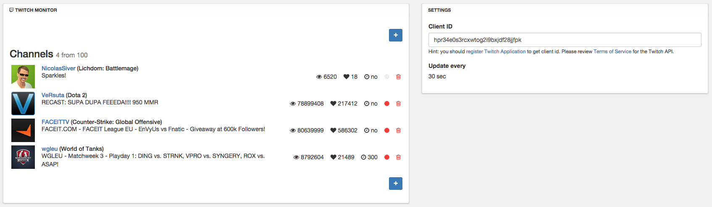
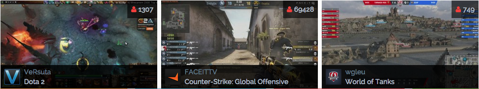

# NodeBB: Twitch Monitor
Monitors specific channels and adds them to widget view

<!-- START doctoc generated TOC please keep comment here to allow auto update -->
<!-- DON'T EDIT THIS SECTION, INSTEAD RE-RUN doctoc TO UPDATE -->
 

- [Notes](#notes)
- [Look](#look)
  - [ACP](#acp)
  - [Widget](#widget)
- [TODO](#todo)
- [Changelog](#changelog)

<!-- END doctoc generated TOC please keep comment here to allow auto update -->

## Notes

- At Server start, some time is needed to fetch enough data for stream statuses
- Highly recommended to limit concurrent streams in widget view, by default - 3

## Look

### ACP

### Widget

## TODO

- ACP: Prompt before remove of channel
- ACP: Show progress on channel add
- ACP: Show progress on client id validation
- ACP: Show animated update ticks
- ACP: Update stream status in real time
- Tests: add tests client and server
- Core: use stream pagination
- Core: smart list update - merge online/offline states, etc
- Core: batch stream status updates
- Core: edit update time
- Widget: create cross-fade thumbnail update
- Widget: user Twitch Video Player

## Changelog

**1.0.1 - 15.07.2015**

- Persist channel updates
- Update channel data for active streams

**1.0.0 - 30.06.2015**

- Initial release
