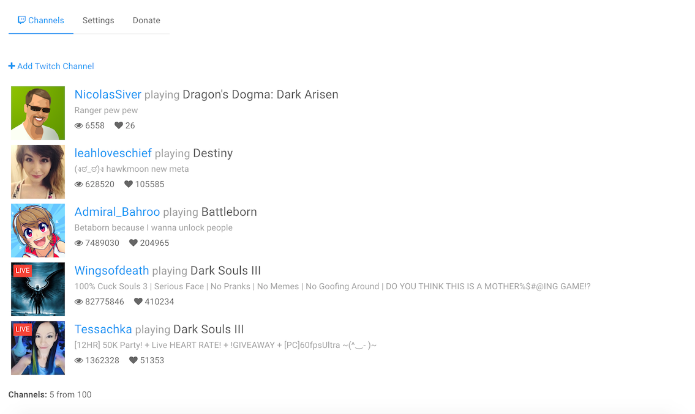
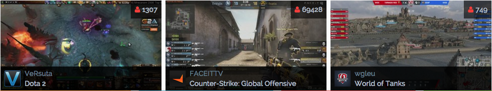

# NodeBB: Twitch Monitor
Monitors specific channels and adds them to widget view


[](https://www.bithound.io/github/NicolasSiver/nodebb-plugin-ns-twitch-monitor)


<!-- START doctoc generated TOC please keep comment here to allow auto update -->
<!-- DON'T EDIT THIS SECTION, INSTEAD RE-RUN doctoc TO UPDATE -->
 

- [Notes](#notes)
- [Look](#look)
  - [ACP](#acp)
  - [Widget](#widget)
- [TODO](#todo)

<!-- END doctoc generated TOC please keep comment here to allow auto update -->

## Notes

- At Server start, some time is needed to fetch enough data for stream statuses
- Highly recommended to limit concurrent streams in widget view, by default - 3

## Look

### ACP



### Widget



## TODO

- ACP: Show progress on channel add
- ACP: Show animated update ticks
- ACP: Update stream status in real time
- Tests: add tests client and server
- Core: use stream pagination
- Core: smart list update - merge online/offline states, etc
- Core: batch stream status updates
- Core: edit update time
- Widget: create cross-fade thumbnail update
- Widget: use Twitch Video Player

# V2
I updated the plugin to use the new twitch API, and updated some libraries for the widget code. To make it work, you must the following code in the global footer of the page
```
<script>
    'use strict';
    console.log("INITIALIZING");

    $(document).ready(function () {
        var limit  = {limit},
            layout = '{layout}';

        ns.TwitchMonitor.init(limit, layout, '.widget-twitch-monitor');
    });
</script>
```

You must put your OAuth token on line 40 of plugin/twitch/api.js. You can use [this site](https://twitchtokengenerator.com/) to generate a client id and oauth token (Access token).

Finally, now you must now enter the user ID instead of the username. You can query the https://api.twitch.tv/helix/search/channels?query=<username> endpoint with your client-id and Authorization headers.
## Notes  for developers
To build the acp and widget javascript files, you must use browserify and webpack, respectively.
